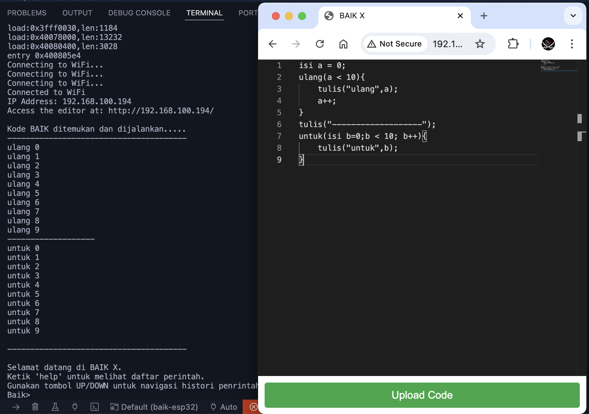

# BAIK × ESP32

**Memrogram ESP32 dengan bahasa Indonesia — interaktif, tanpa flash ulang.**

BAIK × ESP32 adalah firmware yang menanamkan penerjemah (interpreter) bahasa skrip
**BAIK** langsung di dalam papan ESP32. Sekali firmware ini di-flash, papanmu berubah
menjadi komputer kecil yang bisa diajak bicara: buka monitor serial, ketik
`tulis("halo")`, tekan Enter, dan jawabannya langsung muncul. Mau menyalakan LED,
membaca sensor, memindai jaringan Wi-Fi, atau menulis berkas? Cukup ketik satu baris —
tidak ada langkah *compile*, tidak ada `pio run -t upload`, tidak ada menunggu 40 detik
setiap kali kamu mengubah satu angka. Kalau programmu sudah jadi, simpan sebagai berkas
`.ina` lewat editor web yang dilayani papan itu sendiri, dan papan akan menjalankannya
otomatis setiap kali menyala. Semua kata kuncinya berbahasa Indonesia (`isi`, `jika`,
`ulang`, `untuk`, `fungsi`, `balik`, `tulis`), sementara nama fungsi perangkat kerasnya
sengaja dibuat identik dengan Arduino (`pinMode`, `digitalWrite`, `analogRead`,
`WiFi.begin`) supaya pengetahuan Arduino yang sudah kamu punya tetap terpakai.


> **Catatan lisensi:** repositori ini belum memuat berkas `LICENSE` / `LISENSI`,
> jadi status lisensinya **belum ditentukan**. *TODO: pemilik repo perlu
> menetapkan dan menambahkan berkas lisensi.*

---



*Kiri: monitor serial. Skrip `/baik.ina` dijalankan otomatis saat papan menyala
(terlihat keluaran `ulang 0..9` dan `untuk 0..9`), lalu prompt `Baik>` siap menerima
perintah. Kanan: editor web yang dilayani papan itu sendiri di `http://<alamat-ip>/` —
tulis kode, tekan tombol unggah, papan menyimpan lalu mulai ulang dan menjalankannya.
(Tampilan editor pada tangkapan layar ini berasal dari versi sebelumnya; tata letaknya
sudah diperbarui, alurnya tetap sama.)*

---

## Fitur utama

- **REPL serial interaktif.** Prompt `Baik>` di 115200 baud. Ketik ekspresi BAIK,
  langsung dieksekusi. Ada riwayat perintah (tombol ↑/↓), penyuntingan baris, dan
  pelengkapan otomatis nama perintah (via linenoise/esp_console).
- **Editor web + unggah SPIFFS.** Papan melayani halaman editornya sendiri di `/`
  (murni HTML/CSS/JS inline, tanpa CDN, supaya tetap terbuka saat papan berada dalam
  mode Access Point tanpa internet). Tulis kode, tentukan nama berkas `.ina`, tekan
  unggah — berkas tersimpan di SPIFFS lalu papan mulai ulang. Halaman `/ap` dipakai
  untuk mengisi SSID dan kata sandi Wi-Fi.
- **Jalan otomatis saat boot.** Berkas `/baik.ina` dieksekusi sebelum REPL siap,
  sehingga papan bisa dipakai sebagai perangkat mandiri tanpa komputer.
- **API ESP32 yang lengkap dan bernama Arduino.** GPIO, ADC, DAC, PWM/LEDC, Touch,
  interupsi, I2C (`Wire`), SPI, UART (`Serial1`/`Serial2`), Wi-Fi, HTTP, NTP, mDNS,
  NVS (`Preferences`), SPIFFS, dan *deep sleep*. Lihat [docs/API.md](docs/API.md).
- **Alias berbahasa Indonesia.** `tulisDigital`, `bacaAnalog`, `tunggu`, `acak`,
  `pindaiI2C`, dan seterusnya — nilainya fungsi native yang sama persis, bukan
  pembungkus.
- **Validasi pin otomatis.** Setiap fungsi yang menerima nomor pin mengecek
  kapabilitas pin lebih dulu (ADC? DAC? sentuh? RTC? pin flash?) dan menolak dengan
  pesan galat berbahasa Indonesia, bukan me-*reboot* papan.
- **Dukungan dua papan.** ESP32 klasik dan ESP32-S3, dari satu basis kode yang sama.
- **Perintah konsol bawaan.** `pinout` mencetak peta pin papan yang sedang dipakai,
  `api` mencetak seluruh fungsi yang tersedia, `ls`/`cat`/`run` untuk mengelola dan
  menjalankan skrip di SPIFFS.

## Papan yang didukung

| Papan | Chip | Env PlatformIO | Catatan |
|---|---|---|---|
| DOIT ESP32 DEVKIT V1 | ESP32 (Xtensa LX6, 2 inti) | `esp32doit-devkit-v1` | Papan acuan. Punya DAC (2 kanal) dan sensor sentuh `T0`–`T9`. |
| ESP32-S3-DevKitC-1 | ESP32-S3 (Xtensa LX7, 2 inti) | `esp32-s3-devkitc-1` | **Tidak punya DAC** — fungsi `dacWrite` tetap terdaftar tetapi mengembalikan galat yang jelas. Sensor sentuh `T1`–`T14`. Punya USB-Serial/JTAG bawaan; di macOS mungkin perlu driver [CH34x](https://www.wch.cn/downloads/CH34XSER_MAC_ZIP.html). |

Peta pin lengkap per papan ada di [docs/PINOUT.md](docs/PINOUT.md), atau ketik
`pinout` di REPL untuk melihat peta papan yang sedang menyala.

## Pasang cepat

**Prasyarat**

- [PlatformIO Core](https://docs.platformio.org/en/latest/core/installation/index.html)
  (`pip install -U platformio`) atau ekstensi PlatformIO di VS Code.
- Kabel USB **data** (bukan kabel khusus-cas) dan driver USB-serial papanmu
  (CP210x/CH34x).
- Python 3 untuk menjalankan PlatformIO.

**Flash firmware, isi SPIFFS, buka konsol**

```bash
# ESP32 klasik
pio run -e esp32doit-devkit-v1 -t upload      # firmware
pio run -e esp32doit-devkit-v1 -t uploadfs    # isi folder data/ -> SPIFFS
pio device monitor -e esp32doit-devkit-v1     # 115200 baud

# ESP32-S3
pio run -e esp32-s3-devkitc-1 -t upload
pio run -e esp32-s3-devkitc-1 -t uploadfs
pio device monitor -e esp32-s3-devkitc-1
```

`-t uploadfs` **wajib** dijalankan minimal sekali: itulah yang memindahkan
`data/index.html`, `data/config.html`, dan `data/baik.ina` ke SPIFFS. Tanpa itu,
editor web dan skrip autorun tidak ada.

Ada juga pembungkus praktis yang membangun semua environment sekaligus:
`tools/build.sh` (lihat [docs/PENGUJIAN.md](docs/PENGUJIAN.md)).

## Hello world

Kedipkan LED onboard dan ikuti tombol BOOT — ketik langsung di prompt `Baik>` atau
simpan sebagai berkas `.ina`:

```javascript
pinMode(LED_BUILTIN, OUTPUT);                                  // LED onboard
pinMode(BOOT_BUTTON, INPUT_PULLUP);                            // tombol BOOT
untuk (isi i = 0; i < 20; i++) {                               // 20 kali kedip
  digitalWrite(LED_BUILTIN, digitalRead(BOOT_BUTTON) === LOW ? HIGH : LOW);
  delay(200);                                                  // tombol ditekan -> LED nyala
}
```

> Variabel di BAIK dideklarasikan dengan **`isi`**, bukan `var`. Kata `var` masih
> dicadangkan tetapi **belum diimplementasi** oleh parser. Lihat
> [docs/BAHASA.md](docs/BAHASA.md).

## Dokumentasi

| Dokumen | Isi |
|---|---|
| [docs/README.md](docs/README.md) | Indeks dokumentasi + saran urutan baca untuk tiap jenis pembaca. |
| [docs/MULAI-CEPAT.md](docs/MULAI-CEPAT.md) | Dari kardus sampai LED berkedip dalam ~10 menit, lengkap dengan pemecahan masalah. |
| [docs/BAHASA.md](docs/BAHASA.md) | Rujukan bahasa BAIK: tipe, operator, kata kunci, fungsi, batasan nyata. |
| [docs/API.md](docs/API.md) | Seluruh fungsi ESP32 yang tersedia di BAIK, per modul, beserta aliasnya. |
| [docs/PINOUT.md](docs/PINOUT.md) | Peta pin ESP32 & ESP32-S3: kapabilitas, pin yang harus dihindari, konstanta. |
| [docs/ARSITEKTUR.md](docs/ARSITEKTUR.md) | Cara kerja firmware di dalam + panduan menambah fungsi API baru. |
| [src/baik/README.md](src/baik/README.md) | Susunan modul interpreter bahasa BAIK + panduan menyuntingnya. |
| [docs/PENGUJIAN.md](docs/PENGUJIAN.md) | Cara membangun, menguji di host/QEMU, dan menguji di papan asli. |
| [examples/](examples/) | Skrip `.ina` siap pakai: kedip, sensor, I2C, Wi-Fi, HTTP, dan lain-lain. |

## Perintah konsol

Semua perintah di bawah bisa diketik di prompt `Baik>`. Apa pun yang **bukan** nama
perintah terdaftar akan diperlakukan sebagai kode BAIK dan dieksekusi.

| Perintah | Guna |
|---|---|
| `help` | Daftar seluruh perintah konsol beserta keterangannya. |
| `api` | Cetak ringkasan seluruh fungsi BAIK-ESP32 yang tersedia. |
| `pinout` | Cetak tabel pin papan ini: GPIO, label sablon, kapabilitas, catatan. |
| `run <berkas>` | Jalankan skrip dari SPIFFS, mis. `run /baik.ina` atau `run contoh.ina`. |
| `ls [dir]` | Daftar berkas di SPIFFS. |
| `cat <berkas>` | Tampilkan isi berkas. |
| `sysinfo` | Informasi chip, SDK, waktu nyala. |
| `meminfo` | Pemakaian heap. |
| `restart` | Mulai ulang papan. |
| `history` | Riwayat perintah yang pernah diketik. |
| `clear` | Bersihkan layar. |

Selain itu tersedia perintah berkas `cd`, `pwd`, `mv`, `cp`, `rm`, `rmdir`, `edit`;
perintah GPIO cepat `pinMode`, `digitalRead`, `digitalWrite`, `analogRead`; dan
perintah jaringan `ping`, `ipconfig` — semuanya berasal dari pustaka
[ESP32Console](https://github.com/anak10thn/ESP32Console).

## Peta repositori

```
baik-esp32/
├── platformio.ini        Definisi dua environment build (ESP32 & ESP32-S3)
├── README.md             Berkas ini
├── src/
│   ├── baik.h            API publik interpreter (baik_create, baik_exec, ...)
│   ├── baik/             Interpreter bahasa BAIK — 17 modul + header internal
│   │   ├── README.md         Panduan membaca & menyunting interpreter
│   │   ├── baik_internal.h   Deklarasi bersama seluruh modul (bukan API publik)
│   │   ├── baik_tokenizer.c  Pemindai leksikal: token, 31 kata cadangan
│   │   ├── baik_parser.c     Pengurai: pernyataan, ekspresi, presedensi
│   │   ├── baik_bcode.c      Penghasil bytecode + peta nomor baris
│   │   ├── baik_exec.c       Mesin virtual: operator, ekspresi, eksekusi
│   │   ├── baik_core.c       Daur hidup, galat, tumpukan, bingkai, lingkup
│   │   ├── baik_gc.c         Pemungut sampah: arena, mark/sweep, pemadatan
│   │   ├── baik_primitive.c  Angka, boolean, kosong, takterdefinisi, fungsi
│   │   ├── baik_string.c     Tipe huruf: slice, indexOf, perbandingan
│   │   ├── baik_array.c      Tipe untaian: panjang, push, splice
│   │   ├── baik_object.c     Tipe objek: properti, iterasi, prototipe
│   │   ├── baik_conversion.c Konversi tipe & uji kebenaran
│   │   ├── baik_json.c       JSON.stringify / JSON.parse
│   │   ├── baik_builtin.c    Fungsi bawaan: tulis, muat, gc, die, JSON, Object
│   │   ├── baik_util.c       tipe, pencetakan nilai, disassembler bytecode
│   │   ├── baik_em_common.c  Pustaka pendukung: log, berkas, varint, mbuf
│   │   ├── baik_ffi.c        Antarmuka fungsi asing (sebagian besar nonaktif)
│   │   └── baik_repl.c       REPL build host (hanya aktif bila BAIK_MAIN)
│   ├── main.cpp          setup(): SPIFFS -> Wi-Fi/AP -> konsol -> server web
│   ├── console.cpp/.h    Task REPL: autorun /baik.ina, pemilah perintah vs kode BAIK
│   └── esp32/            Jembatan BAIK <-> Arduino-ESP32
│       ├── baik_esp32.h  Satu pintu masuk: baik_esp32_register()
│       ├── e32_pins.h    Tabel pin & kapabilitas (sumber kebenaran validasi pin)
│       └── e32_*.cpp     Modul: konstanta, gpio, sistem, bus, jaringan, berkas
├── data/                 Isi SPIFFS (diunggah dengan `pio run -t uploadfs`)
│   ├── index.html        Editor web (tanpa CDN) + tombol unggah
│   ├── config.html       Halaman konfigurasi Wi-Fi (dilayani di /ap)
│   └── baik.ina          Skrip yang dijalankan otomatis saat boot
├── docs/                 Dokumentasi (lihat tabel di atas)
├── examples/             Contoh skrip .ina
├── test/                 Uji unit PlatformIO & uji host
├── tools/                Skrip bantu build/uji
├── res/                  Gambar untuk dokumentasi
├── include/ lib/         Folder standar PlatformIO (belum dipakai)
└── .vscode/              Konfigurasi VS Code hasil generate PlatformIO
```

Interpreter di `src/baik/` adalah **bahasa**, bukan perangkat keras: fungsi ESP32 baru
ditambahkan di `src/esp32/`, bukan di sana. Penjelasan tiap modul, diagram
ketergantungan antar-lapis, dan aturan menyunting ada di
[src/baik/README.md](src/baik/README.md).

## Status & keterbatasan

Proyek ini berguna dan menyenangkan, tetapi bukan JavaScript lengkap. Berikut hal-hal
yang **benar-benar** belum ada, diverifikasi langsung ke sumber interpreter di
`src/baik/`:

- **`var` belum diimplementasi.** Gunakan `isi` untuk mendeklarasikan variabel.
  Menulis `var a = 1;` menghasilkan `[var] tidak terimplementasi`.
- **Tidak ada penanganan eksepsi sama sekali.** `try`, `catch`, `finally`, dan `throw`
  dicadangkan tetapi ditolak parser, jadi galat tidak bisa ditangkap dari dalam skrip.
  Kegagalan dilaporkan lewat nilai balik (`salah`, `-1`, `kosong`) plus pesan ke konsol;
  `die("pesan")` adalah padanan `throw` yang tidak bisa ditangkap.
- **Tidak ada `pilih`/`sama`/`standar` (switch/case/default)** dan tidak ada
  `kerjakan ... ulang` (do-while). Pakai rantai `jika` / `lainnya jika` / `lainnya`,
  dan `ulang` dengan penanda.
- **`delete`, `new`, `void`, `with`, `instanceof` juga ditolak parser.** Seluruhnya ada
  dua belas kata kunci yang dikenali lexer tetapi belum diimplementasi — daftarnya di
  [docs/BAHASA.md](docs/BAHASA.md).
- **`==` dan `!=` ditolak** dengan pesan `Use ===, not ==`. Gunakan `===` / `!==`.
- **Tidak ada konversi tipe implisit.** `"n=" + 1` menghasilkan galat; pakai
  `"n=" + JSON.stringify(1)`.
- **Closure terbatas.** Fungsi yang *dikembalikan* dari fungsi lain tidak membawa
  serta variabel lokal induknya (lingkup induk sudah dihapus). Variabel global tetap
  terlihat.
- **Panjang array/string adalah `.panjang`,** bukan `.length` (`.length` berisi
  `takterdefinisi`).
- **FFI dimatikan.** Fungsi `ffi()` dan `ffi_cb_free()` sengaja dikomentari di
  `baik_init_builtin()` (`src/baik/baik_builtin.c`), jadi skrip BAIK tidak bisa
  memanggil simbol C sembarangan.
  Satu-satunya jalan menambah kemampuan adalah mendaftarkan fungsi native baru —
  lihat [docs/ARSITEKTUR.md](docs/ARSITEKTUR.md).
- **Tidak ada timer asinkron.** Tidak ada `setTimeout`/`setInterval`/`Promise`.
  Skrip berjalan sinkron di dalam task REPL, jadi loop tak terbatas
  (`ulang (benar) { ... }`) akan **memblokir REPL** sampai papan di-reset.
- **Interupsi ditunda, bukan langsung.** ISR hanya menaikkan penghitung; callback
  BAIK-nya dijalankan belakangan dari task konsol. Jadi jangan harapkan latensi
  mikrodetik dari `attachInterrupt`.
- **Wi-Fi tidak diemulasikan di QEMU.** Uji di emulator hanya mencakup bahasa dan
  logika; semua yang menyangkut radio harus diuji di papan asli.
- Interpreter menyimpan **semua angka sebagai `double`**, jadi operasi bitwise
  dibatasi 32 bit dan bilangan bulat aman sampai 2^53.

## Berkontribusi

1. *Fork* dan buat cabang dari `main`.
2. Patuhi kontrak API: nama fungsi perangkat keras **identik dengan Arduino-ESP32**,
   alias bahasa Indonesia adalah nilai yang sama persis, dan setiap fungsi yang
   menerima nomor pin **wajib** memanggil validasi pin lebih dulu.
3. Tulis contoh dan dokumen dalam bahasa Indonesia yang rapi, dengan kata kunci BAIK
   yang benar (`isi`, `fungsi`, `balik`, `jika`, `lainnya`, `untuk`, `ulang`,
   `benar`, `salah`, `kosong`, `tulis`).
4. Bangun kedua environment sebelum mengirim PR:
   `pio run -e esp32doit-devkit-v1 && pio run -e esp32-s3-devkitc-1`.
5. Jalankan uji sesuai [docs/PENGUJIAN.md](docs/PENGUJIAN.md).

Laporan bug dan usulan fitur ditunggu di
<https://github.com/baik-lang/baik-esp32/issues>.

## Ucapan terima kasih

Proyek ini berdiri di atas karya orang lain:

- **[ESP32Console](https://github.com/anak10thn/ESP32Console)** — kerangka REPL
  serial, linenoise, dan perintah sistem/berkas/GPIO.
- **[ESPAsyncWebServer](https://github.com/me-no-dev/ESPAsyncWebServer)** — server
  web asinkron yang melayani editor dan penerima unggahan berkas.
- **Espressif** untuk ESP-IDF dan arduino-esp32, serta **PlatformIO** untuk *toolchain*
  yang membuat semuanya bisa dibangun dengan satu perintah.
